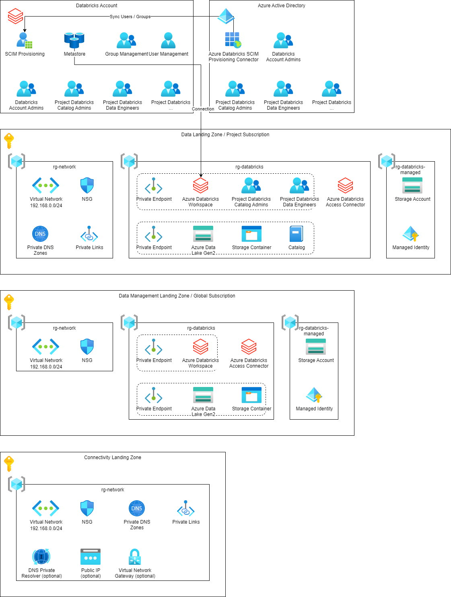

# Terraform - Azure - Databricks

## Table of Contents

* [Introduction](#introduction)
* [Pre-Requirements](#pre-requirements)
* [Connectivity Landing Zone](#modules)
  * [Shared](#shared)
  * [DNS Private Resolver](#dns-private-resolver)
  * [Virtual Network Gateway](#virtual-network-gateway)
* [Data Management Landing Zone](#data-management-landing-zone)
  * [Shared](#shared-1)
  * [Databricks Workspace](#databricks-workspace)
  * [Metastore](#metastore)
* [Data Landing Zone](#data-landing-zone)
  * [Shared](#shared-2)
  * [Databricks Workspace](#databricks-workspace-1)
  * [Catalog](#catalog)
* [Resources](#resources)

## Introduction

This is a collection of Terraform scripts that can be used to create Azure Databricks environment including Unity Catalog with Metastore, catalog, groups and permissions. Please check the [Resources](#resources) for full documentations provided by Microsoft.

## Azure Infrastructure

## Pre-Requirements

* Service Principal
* Remote Backend
* [terraform-azure-setup-remote-backed](https://github.com/gutt02/terraform-azure-setup-remote-backend)

## Connectivity Landing Zone

Provides all required resources to setup a simple connectivity landing zone for the Databricks environment.

### Modules

* Shared
* DNS Private Resolver
* Virtual Network Gatway

### Variables

| Name | Description | Default |
| --- | --- | --- |
| agent_ip | IP of the deployment agent. | |
| client_ip | Client IP. |
| client_secret | Client secret of the service principal. |
| global_settings" | Global settings | `azurecaf_name = {prefixes = ["az", "cf", "clz"]}` |
| location | Default Azure region, use Azure CLI notation. | `westeurope` |
| enable_module_dns_private_resolver | Enable DNS Private Resolver. | `true` |
| enable_module_virtual_network_gateway | Enable Virtual Network Gateway. | `true` |
| on_premises_networks | List of on premises networks. | `{name = "AllowFromOnPremises1", cidr = "10.0.0.0/24", start_ip_address = "10.0.0.0", end_ip_address = "10.0.0.255"}` |
| private_dns_zones | Map of private DNS zones. | `{dns_zone_azuredatabricks = "privatelink.azuredatabricks.net", dns_zone_blob = "privatelink.blob.core.windows.net", dns_zone_dfs = "privatelink.dfs.core.windows.net"}` |
| tags | Default tags for resources, only applied to resource groups. | `{created_by  = "azc-iac-acf-sp-tf", contact     = "contact@me", customer    = "Azure", environment = "Cloud Foundation", project     = "Connectivity Landing Zone"}` |
| virtual_network | VNET destails. | `{address_space = "192.168.0.0/24", subnets = {gateway = {address_space = "192.168.0.0/27", client_address_pool = "192.168.255.0/27", description = "GatewaySubnet"}, bastion = {name = "AzureBastionSubnet", address_space = "192.168.0.32/27"}, private_endpoints = {address_space = "192.168.0.64/27", description = "Private Endpoints"}, dns_private_resolver_inbound = {address_space = "192.168.0.96/28", description = "DNS Private Resolver Outbound"}, dns_private_resolver_outbound = {address_space = "192.168.0.112/28", description = "DNS Private Resolver Inbound"}}}` |
| virtual_network_gateway | Virtual network gateway details. | `{type = "Vpn", vpn_type = "RouteBased", sku = "VpnGw1", vpn_client_configuration = {address_space = ["192.168.255.0/27"], vpn_client_protocols = ["IkeV2", "OpenVPN"], root_certificate = {name = "VnetGatewayConfig"}}}` |

### Output

| Name | Value |
| --- | --- |
| gateway_subnet_id | `module.shared.gateway_subnet_id` |
| private_dns_zone_ids | `module.shared.private_dns_zone_ids` |
| virtual_network_id | `module.shared.virtual_network_id` |

#### Shared

##### Azure Resources

* Resource Group
* Virtual Network and Subnets
* Private DNS zones

##### Variables

| Name | Description | Default |
| --- | --- | --- |
| agent_ip | IP of the deployment agent. | |
| client_ip | Client IP. |
| client_secret | Client secret of the service principal. |
| global_settings | Global settings |  |
| location | Default Azure region, use Azure CLI notation. | |
| on_premises_networks | List of on premises networks. | |
| tags | Default tags for resources, only applied to resource groups. | |
| virtual_network | VNET destails. | |

##### Output

| Name | Value |
| --- | --- |
| dns_private_resolver_inbound_subnet_id | `azurerm_subnet.dns_private_resolver_inbound.id` |
| dns_private_resolver_outbound_subnet_id | `azurerm_subnet.dns_private_resolver_outbound.id` |
| gateway_subnet_id | `azurerm_subnet.gateway.id` |
| private_dns_zone_ids | `azurerm_private_dns_zone.this[*].id` |
| private_endpoints_subnet_id | `azurerm_subnet.private_endpoints.id` |
| virtual_network_id | `azurerm_virtual_network.this.id` |

#### DNS Private Resolver

##### Azure Resources

* DNS Private Resolver

##### Variables

| Name | Description | Default |
| --- | --- | --- |
| global_settings | Global settings |  |
| location | Default Azure region, use Azure CLI notation. | |
| dns_private_resolver_inbound_subnet_id" | Id of the inbound subnet for the DNS Private Resolver. | |
| dns_private_resolver_outbound_subnet_id | Id of the outbound subnet for the DNS Private Resolver. | |

##### Output

| Name | Value |
| --- | --- |

#### Virtual Network Gateway

##### Azure Resources

* Virtual Network Gateway

##### Variables

| Name | Description | Default |
| --- | --- | --- |
| global_settings" | Global settings | |
| location | Default Azure region, use Azure CLI notation. | |
| gateway_subnet_id | Id of the Gateway Subnet | |
| virtual_network_gateway | Virtual network gateway details. | |

##### Output

| Name | Value |
| --- | --- |

## Data Management Landing Zone
### Shared
### Databricks Workspace
### Metastore

## Data Landing Zone
### Shared
### Databricks Workspace
### Catalog

## Resources

* [Cloud-scale analytics - Microsoft Cloud Adaption Framework for Azure](https://learn.microsoft.com/en-us/azure/cloud-adoption-framework/scenarios/cloud-scale-analytics/)
* [Azure Databricks Documentation](https://learn.microsoft.com/en-us/azure/databricks/)
* [Enable Azure Private Link as a standard deployment](https://learn.microsoft.com/en-us/azure/databricks/administration-guide/cloud-configurations/azure/private-link-standard)
* [What is Unity Catalog?](https://learn.microsoft.com/en-us/azure/databricks/data-governance/unity-catalog/)
* [Configure SCIM provisioning using Microsoft Azure Active Directory](https://learn.microsoft.com/en-us/azure/databricks/administration-guide/users-groups/scim/aad)
* [Metastore limits and resource quotas](https://learn.microsoft.com/en-us/azure/databricks/release-notes/unity-catalog/20220825#metastore-limits-and-resource-quotas)
* [Azure Databricks REST API reference](https://docs.databricks.com/api/azure/workspace/introduction)
* [Generate and export certificates for point-to-site using PowerShell](https://learn.microsoft.com/en-us/azure/vpn-gateway/vpn-gateway-certificates-point-to-site)